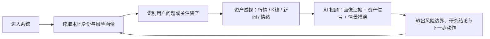
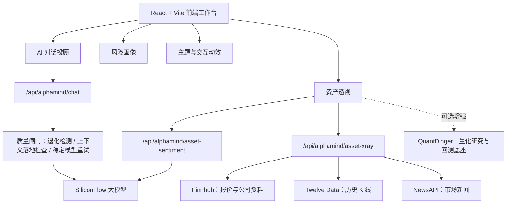

# AlphaMind

> 认知驱动的 AI 投资研究工作台：把用户画像、资产信号、行情图表、新闻情绪和智能投顾组织成一条可解释的研究链路。

[线上体验](https://alphamind.mddcommunity.top) · [GitHub 仓库](https://github.com/LCY2117/AlphaMind-Landing-Page-Design)

AlphaMind 不是一个只展示外观的金融页面，而是一个面向真实投研场景逐步搭建的智能研究系统。它的核心目标不是替用户“预测答案”，而是帮助用户理解：我是谁、我适合承受什么风险、一个资产现在处于什么状态、不同情景下应该关注哪些风险。

它把传统上分散在行情软件、新闻网站、风险测评表和 AI 对话里的信息，重新整理成一个连续工作流：

```text
用户画像 -> 关注资产 -> 行情与新闻信号 -> AI 情景推演 -> 风险边界与行动建议
```

## 项目亮点

- **画像驱动**：AI 回答不再只输出通用教材，而是显式引用用户风险画像、风险分、关注主题和近期资产行为。
- **资产透视**：个股研究独立成页，支持 K 线、雷达评分、新闻线索、AI 多空情绪和概率预测锥。
- **非阻断风险评估**：风险测试不强迫用户答题，默认进入看板，通过柔性引导完成画像更新。
- **真实数据接入准备**：通过服务端代理接入 SiliconFlow、Finnhub、Twelve Data、NewsAPI，并预留 QuantDinger 量化底座。
- **模型质量防线**：快速模型、深度模型、多模态模型分层调用；服务端会拦截乱码、退化输出和未使用上下文的回答。
- **现代产品体验**：统一侧边栏导航、沉浸式对话输入区、深浅色三态主题、空间化页面切换动效、响应式布局。

## 产品主线

AlphaMind 的设计重点不是“给用户推荐一个股票代码”，而是构建一个合规、可解释、可追问的研究闭环。



这个闭环让系统能回答更接近真实场景的问题：

- “我现在是什么类型的投资者？”
- “这只股票适合我继续研究吗？”
- “如果市场下跌，我的组合该怎么调整？”
- “为什么 AI 给出这个判断？”
- “哪些信息还不足，下一步应该补什么？”

## 核心模块

### AI 对话投顾

AIAdvisor 是 AlphaMind 的主交互入口。它支持快速问答、深度分析、图片上传和会话历史，并会把用户画像与资产信号注入到模型上下文中。

关键能力：

- 快速模式使用 `zai-org/GLM-4.5-Air`，用于低延迟投顾问答。
- 深度模式使用 `Pro/zai-org/GLM-4.7`，用于退休规划、资产配置、风险分析等复杂问题。
- 图片理解预留多模态模型能力，支持上传图片和剪贴板粘贴图片。
- Markdown 渲染支持表格、列表、加粗、引用和结构化报告。
- 深度分析轨迹支持折叠展示，避免把专业感变成视觉噪声。
- 服务端质量闸门会拦截异常输出，并要求回答必须使用 AlphaMind 上下文。

### 资产透视

Asset X-Ray 是个股与 ETF 的深度研究面板，不依附于风险测试页面。用户可以从侧边栏进入，也可以在 AI 对话中通过“分析某个资产”触发跳转。

关键能力：

- 交互式 K 线图，支持基于 OHLC 数据绘制历史走势。
- 动态雷达图，覆盖估值、成长、盈利、动量、情绪、波动等维度。
- AI 多空情绪，输出情绪分数、看多因素、看空因素、置信度和解释原因。
- 概率预测锥，用情景区间替代单点预测，降低“伪精确”的误导。
- 扫描式加载动效、图表渐次点亮和结论打字机效果，强化“研究过程”感。
- 数据源不可用时使用本地研究数据兜底，页面不会因为缺少 API Key 而中断。

### 风险画像

RiskAssessment 不再是一次性的问卷页面，而是用户画像中心。它承担“理解用户风险边界”的职责，并将结果反馈给 AI 对话、首页推荐和资产研究。

关键能力：

- 默认进入风险数据看板，而不是强制答题。
- 无画像数据时展示空状态和柔性引导。
- 重新评估通过模态层完成，让用户始终留在看板语境中。
- 画像结果包含风险分、风险等级、六维雷达、配置倾向和 AI 洞察。
- 本地画像会随着对话主题、关注资产和风险测评继续更新。

### 首页认知引擎

首页不是传统营销页，而是 AlphaMind 的“认知入口”。右侧 AI 拓扑图以星系轨道式结构展示资产、行为、风险、市场、情绪等认知节点，并通过呼吸、流光和粒子动效表达实时计算状态。

关键能力：

- 非对称拓扑布局，避免机械三角结构。
- Glassmorphism 背景层、节点发光、内阴影和流动数据线。
- 中心 AI Core 持续脉冲，刷新进入页面后动画也会自动播放。
- 首页推荐与用户画像、关注资产和资产信号保持联动。

## 技术架构



AlphaMind 当前采用 Vite 插件作为轻量服务端代理层。这样做有两个好处：

- 第三方 API Key 不进入浏览器 bundle，避免泄露。
- 前端只消费 AlphaMind 自己的领域数据结构，未来更换数据源不需要重写页面。

## 数据与模型策略

| 能力 | 当前方案 | 用途 | 状态 |
| --- | --- | --- | --- |
| 快速投顾 | SiliconFlow `zai-org/GLM-4.5-Air` | 低延迟问答、功能解释、简短投顾 | 已接入 |
| 深度分析 | SiliconFlow `Pro/zai-org/GLM-4.7` | 退休规划、资产配置、复杂情景推演 | 已接入 |
| 图片理解 | Qwen VL 系列模型 | 截图、图表、图片内容分析 | 已预留 |
| AI 多空情绪 | SiliconFlow | 新闻与行情驱动的情绪评分和解释 | 已接入 |
| 实时报价 | Finnhub | 价格、涨跌、公司资料 | 已接入代理 |
| 历史 K 线 | Twelve Data | OHLC 日线图 | 已接入代理 |
| 市场新闻 | NewsAPI | 情绪分析输入与新闻线索 | 已接入代理 |
| 量化扩展 | QuantDinger | 回测、策略评价、组合研究 | 可选增强 |

### 模型质量防线

AlphaMind 对 AI 输出做了产品级兜底：

- 检测模型退化文本，例如乱码、重复短语、异常字符密度。
- 检查回答是否真实引用用户画像、风险分、关注资产或情景约束。
- 快速模型不合格时自动用稳定模型重试。
- 仍不合格时前端切换到本地画像规则分析，避免把坏回答直接展示给用户。
- 不向用户暴露系统提示词、内部链路或原始思维链。

## 技术栈

| 层级 | 技术 |
| --- | --- |
| 前端框架 | React 18、Vite 6 |
| 样式系统 | Tailwind CSS v4、语义化 CSS Variables |
| 组件体系 | Radix UI、lucide-react、自定义 AlphaMind 组件 |
| 图表能力 | Recharts、TradingView Lightweight Charts |
| Markdown | react-markdown、remark-gfm |
| 动效 | Motion、CSS transform、SVG 动效 |
| 状态与本地记忆 | React Context、localStorage |
| 服务端代理 | Vite middleware |
| 部署 | PM2、OpenResty / Nginx 反向代理 |

## 快速开始

### 1. 克隆项目

```bash
git clone git@github.com:LCY2117/AlphaMind-Landing-Page-Design.git
cd AlphaMind-Landing-Page-Design
```

### 2. 安装依赖

```bash
npm install
```

### 3. 配置环境变量

```bash
cp .env.example .env.local
```

根据需要填写服务端密钥：

```env
SILICONFLOW_API_KEY=
FINNHUB_API_KEY=
TWELVE_DATA_API_KEY=
NEWSAPI_KEY=
```

真实密钥不要提交到 Git 仓库。没有 API Key 时，AlphaMind 仍会使用本地研究数据兜底，保证主要页面可运行。

### 4. 启动开发服务器

```bash
npm run dev
```

如需指定端口或允许局域网访问：

```bash
npm run dev -- --host 0.0.0.0 --port 3001
```

### 5. 生产构建

```bash
npm run build
```

构建产物位于 `dist/`。

## 环境变量

| 变量名 | 暴露位置 | 说明 |
| --- | --- | --- |
| `SILICONFLOW_API_KEY` | 服务端 | SiliconFlow API Key |
| `SILICONFLOW_FAST_MODEL` | 服务端 | 快速投顾模型，默认 `zai-org/GLM-4.5-Air` |
| `SILICONFLOW_DEEP_MODEL` | 服务端 | 深度分析模型，默认 `Pro/zai-org/GLM-4.7` |
| `SILICONFLOW_SENTIMENT_MODEL` | 服务端 | 资产情绪分析模型 |
| `SILICONFLOW_VISION_MODEL` | 服务端 | 图片理解模型 |
| `SILICONFLOW_VISION_DEEP_MODEL` | 服务端 | 深度图片理解模型 |
| `SILICONFLOW_BASE_URL` | 服务端 | SiliconFlow OpenAI-compatible 接口地址 |
| `FINNHUB_API_KEY` | 服务端 | 报价与公司资料数据源 |
| `TWELVE_DATA_API_KEY` | 服务端 | 历史 K 线数据源 |
| `NEWSAPI_KEY` | 服务端 | 新闻数据源 |
| `VITE_ALPHAMIND_DATA_MODE` | 浏览器 | `mock` 或 `quantdinger` |
| `VITE_QUANTDINGER_BASE_URL` | 浏览器 | 可选 QuantDinger 网关地址 |

只有 `VITE_` 前缀变量会进入浏览器环境。所有真实 API Key 都必须保持服务端私有。

## 目录结构

```text
src/
  app/
    components/
      AIAdvisor.tsx          # AI 对话投顾
      AssetXRay.tsx          # 资产透视
      RiskAssessment.tsx     # 风险画像与测评
      HeroSection.tsx        # 首页与 AI 认知拓扑
      Navigation.tsx         # 统一侧边栏导航
      PageTransition.tsx     # 页面切换动效
      SettingsModal.tsx      # 设置与主题入口
    contexts/
      AuthContext.tsx        # 本地身份
      ThemeContext.tsx       # 深色 / 浅色 / 跟随系统
    services/
      aiChat.ts              # AI 对话客户端
      assetXRay.ts           # 资产透视领域数据
      userProfile.ts         # 本地用户画像记忆
      backtest.ts            # QuantDinger 回测扩展面
  styles/
    theme.css                # 语义化主题变量
    globals.css              # 全局样式
vite.config.ts               # Vite 配置与服务端代理
docs/                        # 集成文档、长任务计划与团队反馈
```

## 部署参考

当前线上版本通过 PM2 运行 Vite 服务，并由 OpenResty / Nginx 反向代理到公网域名。

```bash
npm install
npm run build
pm2 start npm --name alphamind -- run dev -- --host 0.0.0.0 --port 3001
pm2 save
```

线上环境建议：

- 将 `.env.local` 或进程环境变量放在服务器，不提交到仓库。
- 通过反向代理暴露 HTTPS 域名。
- 为 AI、行情、新闻接口保留超时和兜底策略。
- 定期检查模型可用性、额度和响应质量。

## 项目文档

- [SiliconFlow 接入说明](docs/SILICONFLOW_CHAT_INTEGRATION.md)
- [QuantDinger 集成说明](docs/QUANTDINGER_INTEGRATION.md)
- [API 申请清单](docs/API_APPLICATION_CHECKLIST.md)
- [团队反馈整理](docs/TEAM_FEEDBACK_SYNTHESIS.md)
- [优化计划](docs/ALPHAMIND_OPTIMIZATION_PLAN.md)

## 路线图

- 接入更多 A 股、港股、美股数据源，提升市场覆盖。
- 将 QuantDinger 扩展为稳定后端能力层，支持回测、策略评价和组合模拟。
- 增加财报因子、估值分位、机构评级和事件时间线。
- 完善用户画像持久化、研究工作区和跨设备同步。
- 增强 AI 输出的图表化能力，让对话直接生成可交互投顾卡片。
- 引入接口契约测试、端到端测试和自动化部署流水线。

## 合规与风险提示

AlphaMind 输出内容仅用于金融知识学习、资产研究辅助和风险理解，不构成投资建议、收益承诺或交易指令。任何真实投资决策都应结合个人风险承受能力、资金状况、市场环境和独立判断。

## 设计来源

原始视觉稿来自 Figma：

https://www.figma.com/design/LgCYrVM3biRMlC9ZWR0CQq/AlphaMind-Landing-Page-Design
