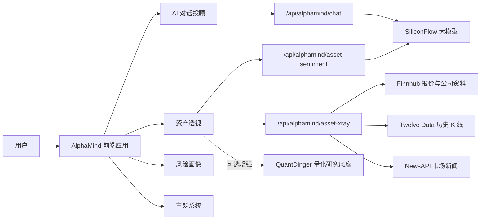

# AlphaMind

> 面向资产研究、风险画像与智能投顾交互的 AI 投资研究工作台。

AlphaMind 不是一个静态落地页，而是一个正在走向真实可用产品的 AI 投资研究系统。它把 AI 对话投顾、个股深度检测、风险承受能力画像、行情图表、新闻情绪分析和深浅色主题系统整合在一个沉浸式工作台中，帮助用户用更结构化、更可解释的方式理解资产与风险。

线上访问：[https://alphamind.mddcommunity.top](https://alphamind.mddcommunity.top)<br>
GitHub 仓库：[https://github.com/LCY2117/AlphaMind-Landing-Page-Design](https://github.com/LCY2117/AlphaMind-Landing-Page-Design)

## 项目定位

传统投研工具往往把行情、新闻、风险评估、策略解释拆散在不同系统里，用户需要自己拼信息、拼逻辑、拼结论。AlphaMind 希望把这些能力重新组织成一个面向决策理解的智能研究助手：

- 用对话降低金融知识门槛。
- 用结构化图表呈现资产质量、市场情绪与价格轨迹。
- 用风险画像把“用户适合什么”和“市场正在发生什么”连接起来。
- 用可解释 AI 输出替代单一结论，让用户知道判断从哪里来。

AlphaMind 始终定位为投资研究辅助工具，不提供确定性收益承诺，也不构成任何买卖建议。

## 核心能力

### AI 对话投顾

- 支持快速模式与深度分析模式。
- 接入 SiliconFlow 对话接口，密钥仅保存在服务端环境变量中。
- 支持 Markdown 渲染，列表、表格、加粗、分段输出更接近专业报告。
- 支持图片上传与剪贴板粘贴图片，预留多模态模型能力。
- 深度模式支持可折叠分析轨迹，兼顾专业感与阅读舒适度。

### 资产透视

- 独立于风险测试模块，作为个股研究入口存在。
- 接入行情、K 线、公司资料、新闻与 AI 情绪分析。
- 使用 `lightweight-charts` 呈现可交互 K 线图，面向真实投研场景。
- 使用 AI 多空情绪模型生成分数、摘要、看多因素、看空因素与置信度。
- 通过雷达图、概率预测锥、诊断卡片组织估值、成长、盈利、动量、情绪、波动等维度。

### 风险画像

- 风险测试不再强制阻断用户进入页面。
- 默认展示风险数据看板；无数据时显示空状态和柔性引导。
- 测评流程以模态框或抽屉方式承载，保持用户仍处于看板语境。
- 支持重新评估入口，让风险画像可持续更新。

### 现代前端体验

- 左侧 Sidebar 统一导航，移除桌面端底部悬浮导航，避免遮挡对话与图表。
- 页面切换使用方向明确的空间动效与阻尼缓动。
- 首页 AI 认知引擎拓扑图具备持续播放的科技视觉动效。
- 支持深色、浅色、跟随系统三态主题，基于语义化 CSS 变量构建。
- 输入区、滚动容器、卡片层级和响应式布局针对长时间阅读做过优化。

## 系统架构



前端通过 Vite 开发服务器插件实现轻量代理层。这样可以把第三方 API Key 留在服务端环境变量中，避免暴露到浏览器，同时让前端组件保持清晰的数据契约。

## 数据与 AI 接入

| 能力 | 平台 | 当前用途 | 接入优先级 |
| --- | --- | --- | --- |
| AI 对话投顾 | SiliconFlow | 快速回答、深度分析、多模态预留 | 高 |
| AI 多空情绪 | SiliconFlow | 基于行情与新闻生成情绪评分和解释 | 高 |
| 实时报价与公司资料 | Finnhub | 个股价格、涨跌、公司基础信息 | 高 |
| 历史 K 线 | Twelve Data | 历史 OHLC 数据与交互式 K 线图 | 高 |
| 新闻样本 | NewsAPI | 个股相关新闻与情绪分析输入 | 中高 |
| 量化研究底座 | QuantDinger | 回测、策略评价、组合分析扩展 | 中 |

## 技术栈

- 前端框架：Vite 6、React 18
- 样式系统：Tailwind CSS v4、语义化 CSS 变量
- 组件基础：Radix UI、lucide-react、自定义 AlphaMind 组件
- 动效实现：Motion、基于 `transform` 的页面切换动画
- 图表能力：Recharts、TradingView Lightweight Charts
- Markdown 渲染：react-markdown、remark-gfm
- AI 代理：兼容 SiliconFlow 的对话补全接口
- 部署方式：PM2、OpenResty/Nginx 反向代理

## 本地运行

### 1. 安装依赖

```bash
npm install
```

### 2. 配置环境变量

复制环境变量模板：

```bash
cp .env.example .env.local
```

在 `.env.local` 中填写服务端 API Key。真实密钥不要提交到仓库。

```bash
SILICONFLOW_API_KEY=
FINNHUB_API_KEY=
TWELVE_DATA_API_KEY=
NEWSAPI_KEY=
```

### 3. 启动开发服务器

```bash
npm run dev
```

如果需要让局域网内设备访问：

```bash
npm run dev -- --host 0.0.0.0 --port 3001
```

### 4. 生产构建

```bash
npm run build
```

构建产物会输出到 `dist/`。

## 环境变量说明

| 变量名 | 作用范围 | 说明 |
| --- | --- | --- |
| `SILICONFLOW_API_KEY` | 仅服务端 | SiliconFlow API Key，用于对话、深度分析和情绪分析 |
| `SILICONFLOW_FAST_MODEL` | 仅服务端 | 快速回答模型 |
| `SILICONFLOW_DEEP_MODEL` | 仅服务端 | 深度分析模型 |
| `SILICONFLOW_SENTIMENT_MODEL` | 仅服务端 | 资产透视中的情绪分析模型 |
| `SILICONFLOW_VISION_MODEL` | 仅服务端 | 图片理解模型 |
| `SILICONFLOW_BASE_URL` | 仅服务端 | SiliconFlow 对话接口地址 |
| `FINNHUB_API_KEY` | 仅服务端 | 报价与公司资料数据源 |
| `TWELVE_DATA_API_KEY` | 仅服务端 | 历史 K 线数据源 |
| `NEWSAPI_KEY` | 仅服务端 | 市场新闻数据源 |
| `VITE_ALPHAMIND_DATA_MODE` | 浏览器 | 数据模式，可选 `mock` 或 `quantdinger` |
| `VITE_QUANTDINGER_BASE_URL` | 浏览器 | 可选 QuantDinger 网关地址 |

只有以 `VITE_` 开头的变量会暴露到浏览器。所有真实 API Key 都应保持服务端私有。

## 目录结构

```text
src/
  app/
    components/
      AIAdvisor.tsx          # AI 对话投顾
      AssetXRay.tsx          # 个股资产透视
      RiskAssessment.tsx     # 风险画像与测评
      HeroSection.tsx        # 首页与 AI 拓扑视觉
      Navigation.tsx         # Sidebar 导航
      PageTransition.tsx     # 页面切换动效
      SettingsModal.tsx      # 设置与主题入口
    contexts/
      AuthContext.tsx
      ThemeContext.tsx
    services/
      aiChat.ts
      assetXRay.ts
      alphamindConfig.ts
  styles/
    theme.css
    globals.css
vite.config.ts              # Vite 配置与接口代理层
.env.example                # 安全的环境变量模板
```

## 部署说明

当前线上版本使用 PM2 运行 Vite 服务，并通过 OpenResty/Nginx 做域名反向代理。

```bash
npm run build
pm2 start npm --name alphamind -- run dev -- --host 0.0.0.0 --port 3001
pm2 save
```

生产环境推荐将真实密钥放入服务器 `.env.local` 或进程环境变量中，不要写入仓库。

## 后续路线

- 接入更多市场数据源，提升 A 股、港股、美股覆盖。
- 将 QuantDinger 作为后端研究底座，补充回测、策略评价与组合分析。
- 增强资产透视的财报因子、估值分位、机构评级和事件时间线。
- 加入用户级风险画像持久化、登录态与个人研究工作区。
- 支持更真实的推理流式输出、模型降级策略与服务健康检查。
- 完善端到端测试、接口契约测试和部署流水线。

## 风险提示

AlphaMind 输出内容仅用于金融知识学习与资产研究辅助，不构成投资建议、收益承诺或交易指令。任何真实投资决策都应结合个人风险承受能力、资金状况和独立判断。

## 设计来源

原始视觉设计来自 Figma：

https://www.figma.com/design/LgCYrVM3biRMlC9ZWR0CQq/AlphaMind-Landing-Page-Design
