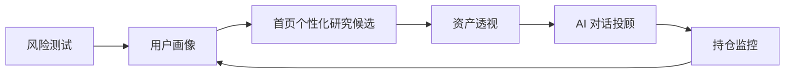
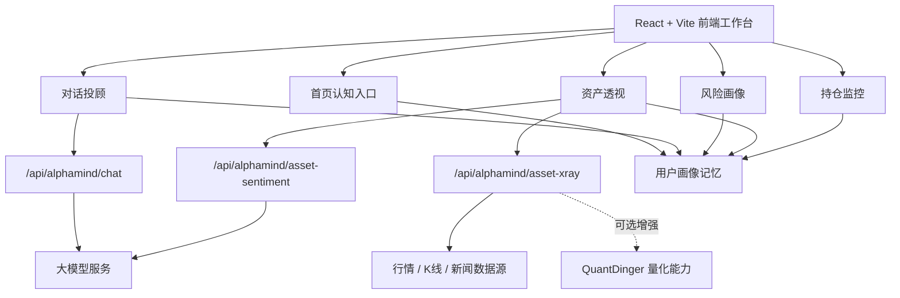

# AlphaMind

> 认知驱动的 AI 投资研究工作台。  
> 用用户画像理解“人”，用资产透视理解“标的”，用风险评估理解“边界”，用持仓监控理解“组合”，用 AI 投顾解释“为什么”。

[线上体验](https://alphamind.mddcommunity.top) · [GitHub 仓库](https://github.com/LCY2117/AlphaMind-Landing-Page-Design)

## Docker / 迁移运行

```bash
cp .env.example .env.local
# 编辑 .env.local，填入服务端运行所需 API Key 和代理配置
docker compose up -d --build
```

默认服务监听服务器本机：

```text
http://127.0.0.1:3001
```

公网访问建议继续通过 1Panel/OpenResty 反向代理。当前 AlphaMind 与 QuantDinger 的耦合点是 `/api/quantdinger/` 代理边界，迁移时应保持该路径指向 QuantDinger 前端/API 的稳定上游。

停止容器：

```bash
docker compose down
```

## 项目定位

AlphaMind 是一个面向个人投资者的智能投研工作台，目标不是制造确定性预测，也不是替用户做交易决策，而是把投资过程中最容易被割裂的几件事重新组织成一条连续链路：

```text
用户画像 -> 资产信号 -> 风险边界 -> AI 情景推演 -> 组合监控 -> 可解释投顾建议
```

传统投资工具往往把行情、新闻、风险测评、资产配置和 AI 问答分散在不同入口里。AlphaMind 试图把这些能力整合到一个统一的研究界面中，让用户能够持续回答几个关键问题：

- 我属于什么风险画像？
- 我关注的资产现在处于什么状态？
- 当前判断背后的多空因素是什么？
- 我的持仓组合是否存在集中度或波动风险？
- AI 为什么给出这个建议，哪些条件变化会改变判断？

AlphaMind 的核心价值不是“给出一个答案”，而是让投资研究过程变得可解释、可视化、可追问。

## 核心亮点

| 能力 | 说明 |
| --- | --- |
| 画像驱动投顾 | AI 回答会结合风险等级、风险分、关注资产和行为证据，而不是输出通用话术。 |
| 资产透视 | 支持 K 线、雷达评分、AI 多空情绪、新闻线索、概率预测锥和诊断总结。 |
| 风险画像看板 | 风险测试默认进入看板，不强制答题，支持柔性重新评估和画像更新。 |
| 持仓动态监控 | 支持按账户、资产类型、时间范围和关键词筛选持仓，展示收益走势、配置结构和风险提示。 |
| AI 投顾与理财科普 | 对话页拆分为“投顾建议”和“理财科普”，兼顾决策解释与知识学习。 |
| 数据适配层 | 前端消费 AlphaMind 领域数据结构，后端可接行情、新闻、量化和 AI 服务。 |
| 真实服务接入准备 | 已预留 SiliconFlow、Finnhub、Twelve Data、NewsAPI、QuantDinger 等能力入口。 |
| 现代产品体验 | 统一侧边栏、深浅色主题、空间化页面切换、Markdown 渲染、图表化回答和响应式布局。 |

## 产品闭环



AlphaMind 把“测评、研究、问答、监控”连成闭环。用户每一次风险评估、资产搜索、对话提问和持仓观察，都会成为后续个性化解释的上下文。

## 核心功能

### 首页：认知入口

首页不是传统落地页，而是 AlphaMind 的认知入口。

主要能力：

- 展示本地账户画像、风险分、情绪状态和关注证据。
- 根据用户画像生成个性化研究候选。
- 支持直接搜索资产并跳转资产透视。
- 右侧 AI 认知拓扑图展示资产、行为、意图、安全等认知节点。
- 深色和浅色模式下均保持可读性和科技感。

### 对话投顾：从聊天到研究

对话投顾是 AlphaMind 的主交互入口。它不只是一个聊天框，而是连接用户画像、资产研究和投顾解释的入口。

主要能力：

- “投顾建议”模块：面向资产配置、退休规划、风险边界和情景推演。
- “理财科普”模块：面向金融概念解释、投资原则学习和主动科普。
- 支持图片上传，为多模态分析预留入口。
- 支持 Markdown、表格、列表、加粗、引用等结构化渲染。
- 支持图表化回答卡片，减少纯文字问答的单调感。
- 支持会话历史、个性化追问和资产透视跳转。
- AI 头像使用 AlphaMind 小机器品牌形象，提升产品一致性。

### 风险测试：用户画像中心

风险测试不是孤立问卷，而是用户画像更新机制。

主要能力：

- 默认展示风险数据看板。
- 支持无数据空状态和柔性引导。
- 通过弹层完成重新评估，不打断看板体验。
- 展示风险分、风险等级、风险雷达和画像证据。
- 测评结果会同步影响首页推荐、对话投顾和资产解释。

### 资产透视：个股与 ETF 深度检测

资产透视是 AlphaMind 的核心研究模块，用于把一个资产拆解成多维信号。

主要能力：

- 资产搜索与快速切换。
- K 线走势与历史价格查看。
- AI 综合评分。
- 估值、成长、盈利、情绪、动量、安全边际多维雷达。
- AI 多空情绪评分与原因解释。
- 新闻与事件线索。
- 概率预测锥，用区间表达替代单点预测。
- AI 诊断总结和风险提示。
- 数据源状态展示，明确当前分析覆盖范围。

### 持仓监控：组合级风险视角

持仓监控让 AlphaMind 从“单资产研究”延伸到“组合管理”。

主要能力：

- 按账户筛选。
- 按资产类型筛选。
- 按时间范围筛选。
- 按关键词搜索。
- 展示收益走势预测。
- 展示资产配置占比。
- 展示组合风险雷达。
- 展示持仓明细。
- 输出 AI 风险提示。

### 核心功能页：能力总览

核心功能页用于收束 AlphaMind 的能力结构，让用户快速理解系统从画像、投顾、资产分析到组合监控的完整路径。

## 核心技术

### 1. 用户画像记忆引擎

AlphaMind 会沉淀用户风险偏好、风险分数、关注资产、情绪状态和行为证据。

这些画像信息会被多个模块复用：

- 首页用于个性化研究候选。
- 对话投顾用于生成上下文回答。
- 风险测试用于更新风险边界。
- 资产透视用于解释资产是否匹配用户画像。
- 持仓监控用于识别组合风险。

### 2. AI 投顾上下文编排

系统在调用大模型前，会组织 AlphaMind 自己的上下文：

- 用户风险等级。
- 用户风险分。
- 最近关注资产。
- 投资目标和资金约束。
- 资产信号。
- 当前模块意图。

这样 AI 输出不再只是金融百科，而是围绕用户个人条件进行解释。

### 3. 服务端 AI 代理

AlphaMind 通过服务端代理调用 AI 服务，浏览器端不会直接暴露 API Key。

优势：

- 保护密钥安全。
- 统一控制模型路由。
- 支持超时、异常兜底和质量校验。
- 便于未来替换或扩展模型供应商。

### 4. 资产数据适配层

资产透视模块使用统一的 AlphaMind 领域模型承接不同数据源。

前端组件只消费统一结构，例如：

- `AssetXRayReport`
- 行情摘要
- K 线序列
- 新闻线索
- 情绪分析
- 概率区间
- 数据源元信息

这种设计让 Finnhub、Twelve Data、NewsAPI、QuantDinger 或其他数据源可以在适配层切换，而不需要重写页面。

### 5. QuantDinger 量化能力预留

AlphaMind 将 QuantDinger 视为后端能力拼图，而不是前端替代品。

QuantDinger 可以用于：

- 行情与 K 线。
- 技术指标。
- 策略回测。
- 组合分析。
- 量化信号。

AlphaMind 负责用户体验、AI 解释和工作流编排；QuantDinger 可作为底层数据与量化计算能力。

### 6. 可视化与主题系统

AlphaMind 使用图表和动效降低金融信息理解成本。

包括：

- AI 认知拓扑图。
- 风险雷达图。
- 资产评分雷达图。
- K 线图。
- 概率预测锥。
- 收益走势曲线。
- 资产配置图。
- 深色、浅色、跟随系统三态主题。

## 技术架构



## 数据与模型策略

| 能力 | 当前策略 | 说明 |
| --- | --- | --- |
| AI 对话 | SiliconFlow 兼容接口 | 用于投顾建议、理财科普和结构化解释。 |
| AI 情绪 | 大模型 + 规则兜底 | 用于资产多空情绪评分和原因解释。 |
| 行情数据 | 服务端代理 | 可接入 Finnhub、Twelve Data 等数据源。 |
| 新闻数据 | 服务端代理 | 可作为情绪分析和事件线索输入。 |
| 量化能力 | QuantDinger 预留 | 可扩展回测、指标、策略和组合分析。 |
| 本地参考数据 | 内置领域数据 | 在外部服务不可用时保证核心页面可运行。 |

## 技术栈

| 层级 | 技术 |
| --- | --- |
| 前端框架 | React 18、Vite 6 |
| 语言 | TypeScript |
| 样式系统 | Tailwind CSS v4、CSS Variables |
| 组件体系 | Radix UI、lucide-react、自定义 AlphaMind 组件 |
| 图表能力 | Recharts、TradingView Lightweight Charts、自定义 SVG |
| Markdown | react-markdown、remark-gfm |
| 动效 | Motion、CSS transform、SVG 动效 |
| 状态与本地记忆 | React Context、localStorage |
| 服务端代理 | Vite middleware |
| 部署 | GitHub、PM2、OpenResty / Nginx |

## 快速开始

### 克隆项目

```bash
git clone git@github.com:LCY2117/AlphaMind-Landing-Page-Design.git
cd AlphaMind-Landing-Page-Design
```

### 安装依赖

```bash
npm install
```

### 启动开发环境

```bash
npm run dev
```

### 构建生产产物

```bash
npm run build
```

## 环境变量

真实密钥必须放在服务端环境中，不要提交到 Git 仓库。

| 变量名 | 说明 |
| --- | --- |
| `SILICONFLOW_API_KEY` | AI 模型服务 Key |
| `SILICONFLOW_BASE_URL` | AI 模型兼容接口地址 |
| `SILICONFLOW_FAST_MODEL` | 快速回答模型 |
| `SILICONFLOW_DEEP_MODEL` | 深度分析模型 |
| `SILICONFLOW_SENTIMENT_MODEL` | 情绪分析模型 |
| `SILICONFLOW_VISION_MODEL` | 图片理解模型 |
| `FINNHUB_API_KEY` | 行情与公司资料 |
| `TWELVE_DATA_API_KEY` | 历史 K 线 |
| `NEWSAPI_KEY` | 新闻数据 |
| `VITE_ALPHAMIND_DATA_MODE` | 数据模式 |
| `VITE_QUANTDINGER_BASE_URL` | QuantDinger 网关地址 |

说明：

- `VITE_` 前缀变量会进入浏览器环境。
- API Key 不应使用 `VITE_` 前缀。
- 未配置外部 API 时，系统会使用本地参考数据保持核心流程可用。

## 目录结构

```text
src/
  app/
    components/
      AIAdvisor.tsx          # 对话投顾
      AssetXRay.tsx          # 资产透视
      RiskAssessment.tsx     # 风险测试与画像看板
      PortfolioMonitor.tsx   # 持仓动态监控
      HeroSection.tsx        # 首页认知入口
      Navigation.tsx         # 统一侧边栏导航
      PageTransition.tsx     # 页面切换动效
      SettingsModal.tsx      # 设置与主题入口
    contexts/
      AuthContext.tsx        # 本地身份
      ThemeContext.tsx       # 主题模式
    services/
      aiChat.ts              # AI 对话客户端
      assetXRay.ts           # 资产透视数据适配
      userProfile.ts         # 用户画像记忆
      backtest.ts            # 量化回测扩展入口
  imports/                   # 图片与品牌资源
  styles/                    # 全局样式与主题变量
docs/                        # 项目文档
vite.config.ts               # Vite 配置与服务端代理
```

## 项目文档

- [核心技术与核心功能](docs/ALPHAMIND_CORE_TECHNOLOGY_AND_FUNCTIONS.md)
- [核心技术与功能展示参考](docs/ALPHAMIND_CORE_TECH_AND_FEATURES.md)
- [SiliconFlow 接入说明](docs/SILICONFLOW_CHAT_INTEGRATION.md)
- [QuantDinger 集成说明](docs/QUANTDINGER_INTEGRATION.md)
- [API 申请清单](docs/API_APPLICATION_CHECKLIST.md)
- [团队反馈整理](docs/TEAM_FEEDBACK_SYNTHESIS.md)
- [优化计划](docs/ALPHAMIND_OPTIMIZATION_PLAN.md)

## 当前实现边界

已实现：

- 首页认知入口。
- 对话投顾。
- 理财科普。
- 风险测试与画像看板。
- 资产透视。
- 持仓动态监控。
- 深色 / 浅色 / 跟随系统主题。
- AI 与数据服务接入准备。
- 云端部署。

可继续增强：

- 接入更多真实行情、新闻、公告和财务数据源。
- 扩展 QuantDinger 回测与策略评价能力。
- 接入真实持仓或记账数据。
- 增加跨设备用户画像同步。
- 增强合规提示、风险披露和权限边界。
- 增加自动化测试与部署流水线。

## 合规与风险提示

AlphaMind 输出内容仅用于金融知识学习、资产研究辅助和风险理解，不构成投资建议、收益承诺或交易指令。任何真实投资决策都应结合个人风险承受能力、资金状况、市场环境和独立判断。

## 项目价值

AlphaMind 的价值在于把投资研究从“分散的信息查询”升级为“连续的认知工作流”：

```text
理解自己 -> 理解资产 -> 理解风险 -> 理解组合 -> 理解决策
```

它不是一个只会回答问题的 AI 聊天框，而是一个围绕用户、资产和风险持续组织信息的智能投研系统。
